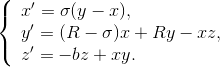

# Description #
Chaotic attractor in a simple three-dimensional autonomous system, which resembles some familiar features from both the Lorenz and Rossler attractors.

# Mathematical model #

# References #
- G. Chen & T. Ueta, Yet another chaotic attractor, International Journal of Bifurcation and Chaos, 9, 1465-1466, 1999.