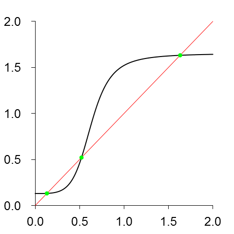
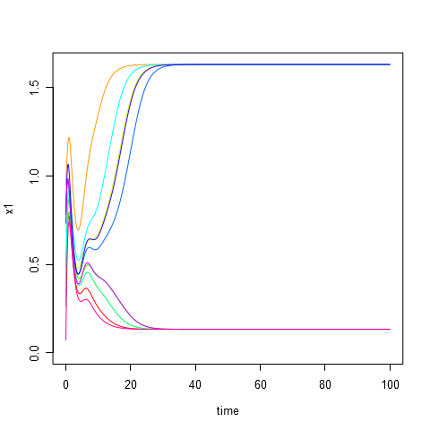
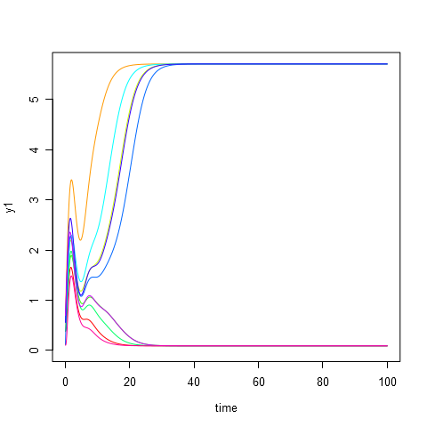
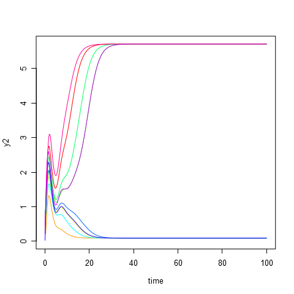
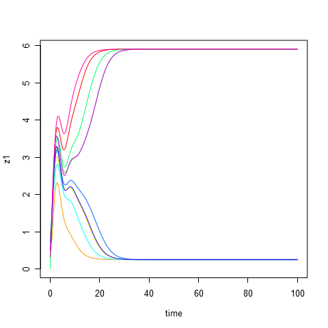
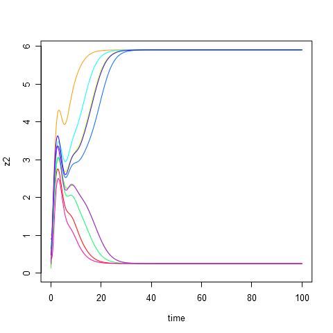

# Parameters #
	A = 5
	a = 3
	B = 10
	b = 2
	C = 9
	c = 3

# Initial data #
|id   |         x1|         y1|         z1|         x2|         y2|         z2|
|:----|----------:|----------:|----------:|----------:|----------:|----------:|
|t1   |  0.2655087|  0.3721239|  0.5728534|  0.9082078|  0.2016819|  0.8983897|
|t2   |  0.9446753|  0.6607978|  0.6291140|  0.0617863|  0.2059746|  0.1765568|
|t3   |  0.6870228|  0.3841037|  0.7698414|  0.4976992|  0.7176185|  0.9919061|
|t4   |  0.3800352|  0.7774452|  0.9347052|  0.2121425|  0.6516738|  0.1255551|
|t5   |  0.2672207|  0.3861141|  0.0133903|  0.3823880|  0.8696908|  0.3403490|
|t6   |  0.4820801|  0.5995658|  0.4935413|  0.1862176|  0.8273733|  0.6684667|
|t7   |  0.7942399|  0.1079436|  0.7237109|  0.4112744|  0.8209463|  0.6470602|
|t8   |  0.7829328|  0.5530363|  0.5297196|  0.7893562|  0.0233312|  0.4772301|
|t9   |  0.7323137|  0.6927316|  0.4776196|  0.8612095|  0.4380971|  0.2447973|
|t10  |  0.0706790|  0.0994662|  0.3162717|  0.5186343|  0.6620051|  0.4068302|

# Equilibrium points #
|id  |         x1|         y1|         z1|         x2|        y2|         z2|
|:---|----------:|----------:|----------:|----------:|---------:|----------:|
|s1  |  0.1322040|  0.0866324|  5.9005324|  1.6319560|  5.711174|  0.2526028|
|s2  |  0.5214762|  1.1969407|  2.5667418|  0.5214761|  1.196940|  2.5667425|
|s3  |  1.6319350|  5.7111106|  0.2526583|  0.1322191|  0.086652|  5.9005100|

# Modeling results #
**composition.png**:

**plot-time-x1.png**:

**plot-time-x2.png**:

**plot-time-y1.png**:

**plot-time-y2.png**:

**plot-time-z1.png**:

**plot-time-z2.png**:

**plot-x1-y1-z1.png**:

**plot-z2-y2-x2.png**:

