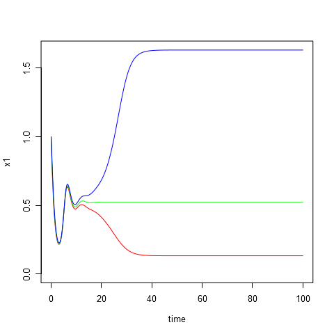
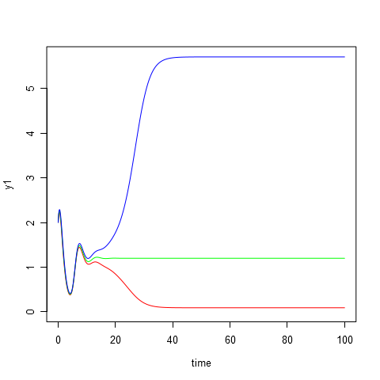
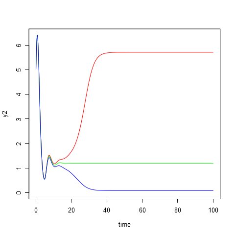
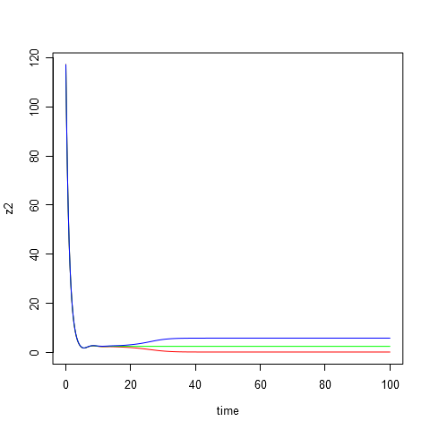

# Parameters #
	A = 5
	a = 3
	B = 10
	b = 2
	C = 9
	c = 3

# Initial data #
|id  |  x1|  y1|   z1|  x2|  y2|        z2|
|:---|---:|---:|----:|---:|---:|---------:|
|t1  |   1|   2|  3.5|   4|   5|  117.2000|
|t2  |   1|   2|  3.0|   4|   5|  117.1163|
|t3  |   1|   2|  2.5|   4|   5|  117.1000|

# Equilibrium points #
|id  |         x1|         y1|         z1|         x2|        y2|         z2|
|:---|----------:|----------:|----------:|----------:|---------:|----------:|
|s1  |  0.1322040|  0.0866324|  5.9005324|  1.6319560|  5.711174|  0.2526028|
|s2  |  0.5214762|  1.1969407|  2.5667418|  0.5214761|  1.196940|  2.5667425|
|s3  |  1.6319350|  5.7111106|  0.2526583|  0.1322191|  0.086652|  5.9005100|

# Modeling results #
**composition.png**:

**plot-time-x1.png**:

**plot-time-x2.png**:

**plot-time-y1.png**:

**plot-time-y2.png**:

**plot-time-z1.png**:

**plot-time-z2.png**:

**plot-x1-y1-z1.png**:

**plot-z2-y2-x2.png**:

