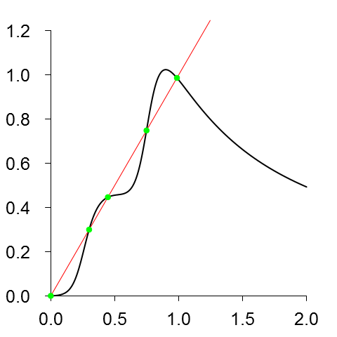
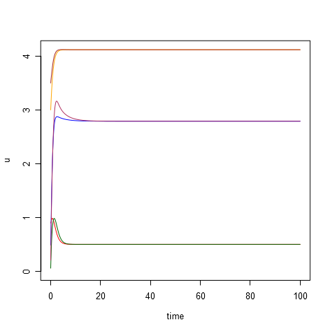
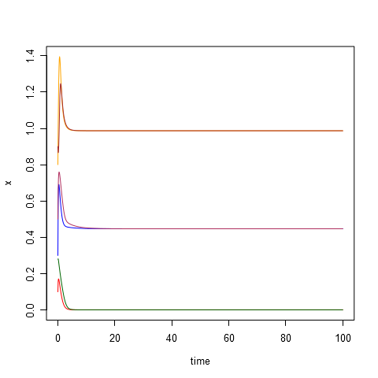
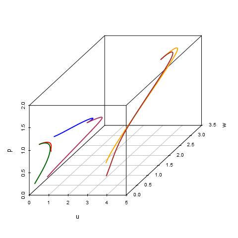

# Parameters #
	d1 = 6.0
	d3 = 40.0
	d5 = 90.0
	A3 =  0.5
	A4 =  0.5
	A5 =  1.5
	A6 =  0.2
	B3 =  2.5
	B4 =  4.2
	B5 =  5.0
	B6 =  2.5
	k3 =  5.0
	k4 =  4.0
	k5 =  4.0
	k6 =  1.0
	C  = 12.0
	D  =  1.5
	E  =  4.0
	G  =  3.0
	U  =  1.2

# Initial data #
|id  |     x|     y|     z|     u|     w|     p|
|:---|-----:|-----:|-----:|-----:|-----:|-----:|
|t1  |  0.10|  0.37|  0.57|  0.90|  0.20|  0.89|
|t2  |  0.28|  0.50|  0.50|  0.06|  0.20|  0.17|
|t3  |  0.30|  0.90|  1.50|  0.49|  0.71|  0.99|
|t4  |  0.50|  0.77|  0.93|  0.21|  0.65|  0.12|
|t5  |  0.80|  0.38|  0.01|  3.00|  0.86|  0.34|
|t6  |  0.90|  0.69|  0.47|  3.50|  0.43|  0.24|

# Equilibrium points #
|id  |          x|         y|          z|          u|          w|         p|
|:---|----------:|---------:|----------:|----------:|----------:|---------:|
|s1  |  0.0009055|  7.983750|  0.1908391|  0.5030531|  0.0124303|  1.126256|
|s2  |  0.3005028|  4.146748|  1.0968796|  1.8938337|  0.0740900|  1.405905|
|s3  |  0.4472240|  3.165529|  1.7536082|  2.7908356|  0.1750210|  1.538954|
|s4  |  0.7491041|  2.459112|  2.3941014|  3.8798094|  0.9081260|  1.789466|
|s5  |  0.9869171|  2.344479|  2.4815556|  4.1184089|  2.4019283|  1.956284|

# Modeling results #
**composition.png**:

**plot-time-p.png**:

**plot-time-u.png**:

**plot-time-w.png**:

**plot-time-x.png**:

**plot-time-y.png**:

**plot-time-z.png**:

**plot-u-w-p.png**:

**plot-x-u-w.png**:

**plot-x-y-z.png**:

