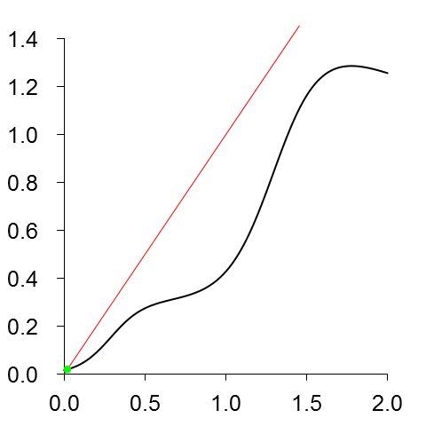
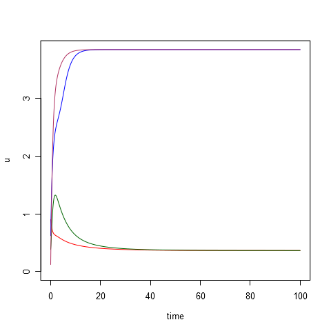
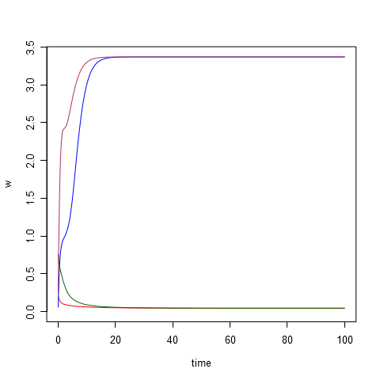
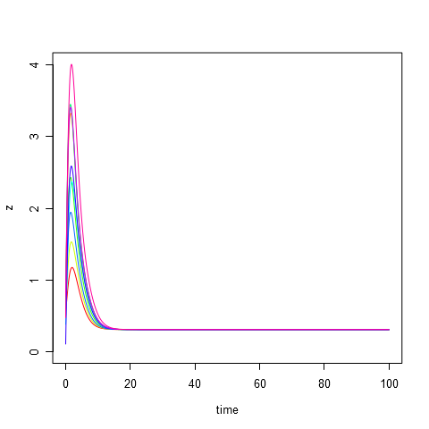
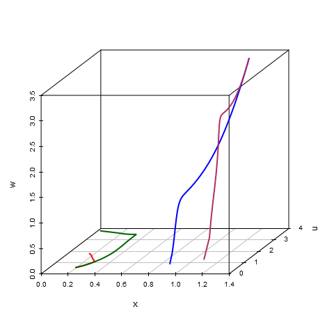
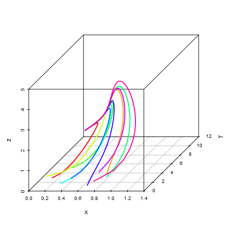

# Parameters #
	d1 =  5.0
	d3 =  6.0
	d5 =  7.0
	A3 =  1.0
	A4 =  2.0
	A5 =  1.0
	B3 =  6.0
	B4 =  5.2
	B5 =  9.0
	k3 =  3.0
	k4 =  4.5
	k5 =  4.0
	C  = 12.0
	D  =  1.5
	E  =  0.5
	G  =  3.0

# Initial data #
|id   |          x|          y|          z|          u|          w|
|:----|----------:|----------:|----------:|----------:|----------:|
|t1   |  0.2655087|  0.3721239|  0.5728534|  0.9082078|  0.2016819|
|t2   |  0.8983897|  0.9446753|  0.6607978|  0.6291140|  0.0617863|
|t3   |  0.2059746|  0.1765568|  0.6870228|  0.3841037|  0.7698414|
|t4   |  0.4976992|  0.7176185|  0.9919061|  0.3800352|  0.7774452|
|t5   |  0.9347052|  0.2121425|  0.6516738|  0.1255551|  0.2672207|
|t6   |  0.3861141|  0.0133903|  0.3823880|  0.8696908|  0.3403490|
|t7   |  0.4820801|  0.5995658|  0.4935413|  0.1862176|  0.8273733|
|t8   |  0.6684667|  0.7942399|  0.1079436|  0.7237109|  0.4112744|
|t9   |  0.8209463|  0.6470602|  0.7829328|  0.5530363|  0.5297196|
|t10  |  0.7893562|  0.0233312|  0.4772301|  0.7323137|  0.6927316|

# Equilibrium points #
|x         |         y|          z|          u|          w|
|:---------|---------:|----------:|----------:|----------:|
|0.020276  |  11.99118|  0.3103338|  0.0007357|  0.1823926|

# Modelling results #
**composition.png**:

**plot-time-u.png**:

**plot-time-w.png**:

**plot-time-x.png**:

**plot-time-y.png**:

**plot-time-z.png**:

**plot-x-u-w.png**:

**plot-x-y-z.png**:

