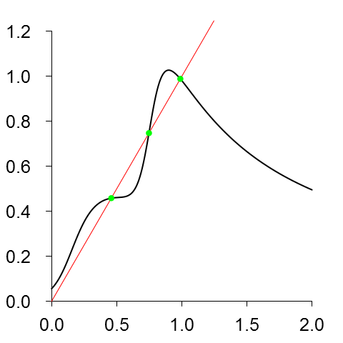
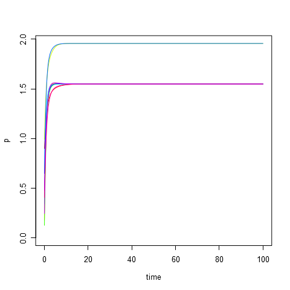
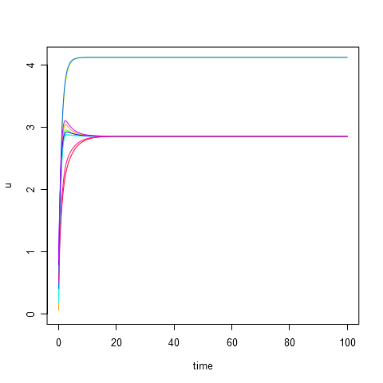
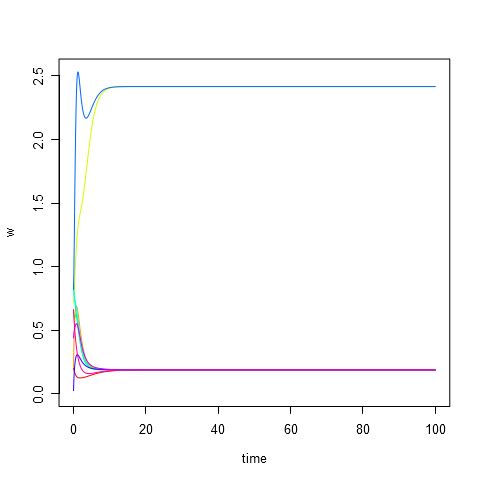
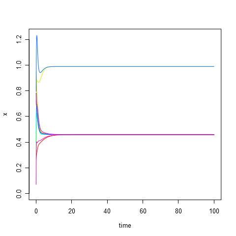
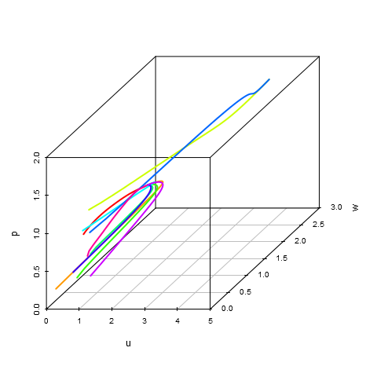
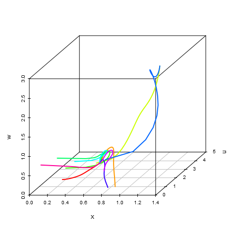

# Parameters #
	d1 = 6.0
	d3 = 40.0
	d5 = 90.0
	A3 =  0.5
	A4 =  0.5
	A5 =  1.5
	A6 =  0.2
	B3 =  3.0
	B4 =  4.2
	B5 =  5.0
	B6 =  2.5
	k3 =  3.0
	k4 =  4.0
	k5 =  4.0
	k6 =  1.0
	C  = 12.0
	D  =  1.5
	E  =  4.0
	G  =  3.0
	U  =  1.2

# Initial data #
|id   |          x|          y|          z|          u|          w|          p|
|:----|----------:|----------:|----------:|----------:|----------:|----------:|
|t1   |  0.2655087|  0.3721239|  0.5728534|  0.9082078|  0.2016819|  0.8983897|
|t2   |  0.9446753|  0.6607978|  0.6291140|  0.0617863|  0.2059746|  0.1765568|
|t3   |  0.6870228|  0.3841037|  0.7698414|  0.4976992|  0.7176185|  0.9919061|
|t4   |  0.3800352|  0.7774452|  0.9347052|  0.2121425|  0.6516738|  0.1255551|
|t5   |  0.2672207|  0.3861141|  0.0133903|  0.3823880|  0.8696908|  0.3403490|
|t6   |  0.4820801|  0.5995658|  0.4935413|  0.1862176|  0.8273733|  0.6684667|
|t7   |  0.7942399|  0.1079436|  0.7237109|  0.4112744|  0.8209463|  0.6470602|
|t8   |  0.7829328|  0.5530363|  0.5297196|  0.7893562|  0.0233312|  0.4772301|
|t9   |  0.7323137|  0.6927316|  0.4776196|  0.8612095|  0.4380971|  0.2447973|
|t10  |  0.0706790|  0.0994662|  0.3162717|  0.5186343|  0.6620051|  0.4068302|

# Equilibrium points #
|id  |          x|         y|         z|         u|          w|         p|
|:---|----------:|---------:|---------:|---------:|----------:|---------:|
|s1  |  0.4585582|  3.113822|  1.911794|  2.853785|  0.1868770|  1.548992|
|s2  |  0.7478161|  2.460269|  2.597696|  3.877516|  0.9023966|  1.788483|
|s3  |  0.9888416|  2.344058|  2.850760|  4.119328|  2.4163435|  1.957512|

# Modeling results #
**composition.png**:

**plot-time-p.png**:

**plot-time-u.png**:

**plot-time-w.png**:

**plot-time-x.png**:

**plot-time-y.png**:

**plot-time-z.png**:

**plot-u-w-p.png**:

**plot-x-u-w.png**:

**plot-x-y-z.png**:

