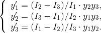

# Description #
Euler's equations (rigid body dynamics)

# Mathematical model #

# References #
- C. A. Truesdell, III and R. A. Toupin (1960) The Classical Field Theories, in S. Flügge (ed.) Encyclopedia of Physics. Vol. III/1: Principles of Classical Mechanics and Field Theory, Springer-Verlag. Sects. 166-168, 196-197, and 294.
- Landau L.D. and Lifshitz E.M. (1976) Mechanics, 3rd. ed., Pergamon Press.