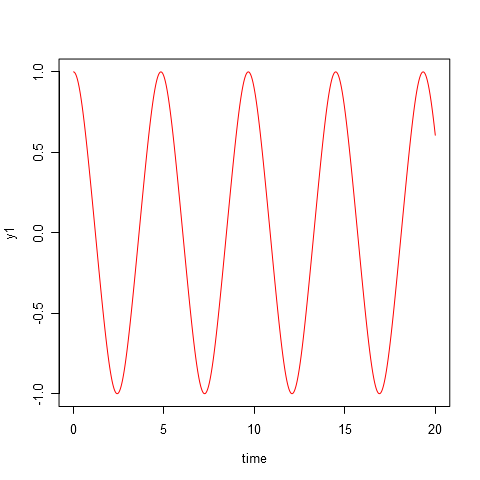
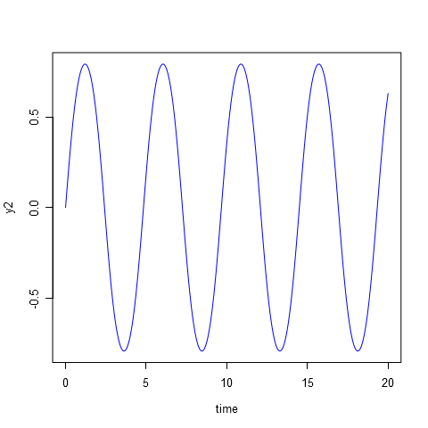
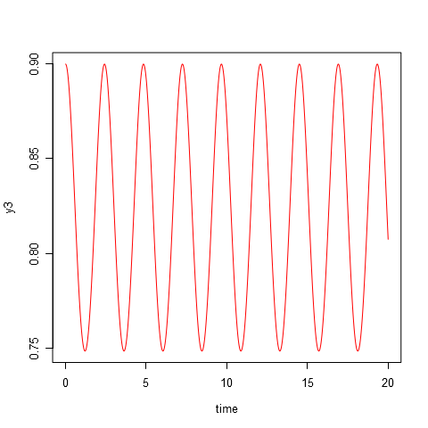

# Parameters #
	I1 = 0.5
	I2 = 2.0
	I3 = 3.0

# Initial data #
|y1  |  y2|   y3|
|:---|---:|----:|
|1   |   0|  0.9|

# Modeling results #
**plot-time-y1.png**:

**plot-time-y2.png**:

**plot-time-y3.png**:

**plot-y1-y2-y3.png**:

