**Lorenz**:

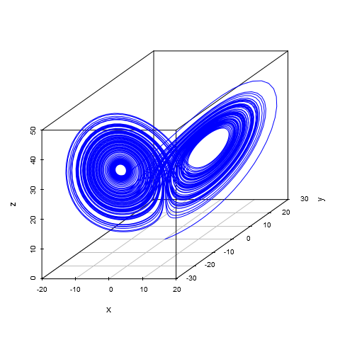

**Rossler**:

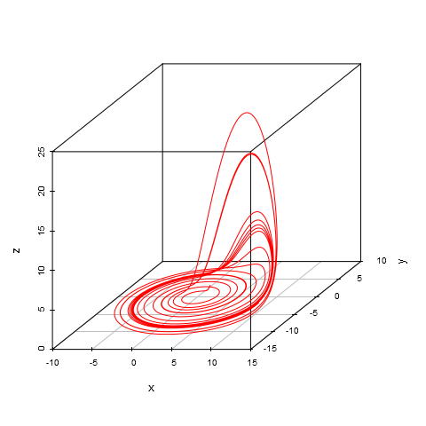

**ThomasLabyrinthChaos**:

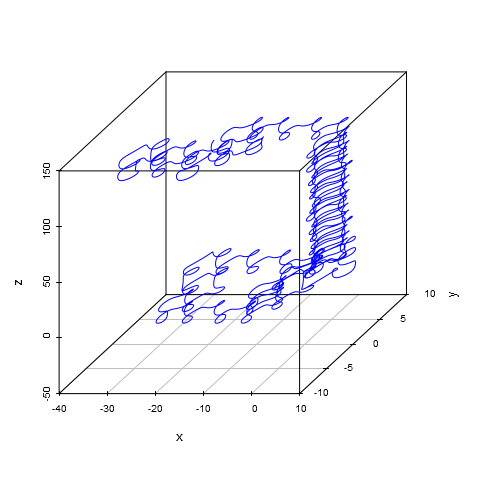

**EulerRigidBody**:

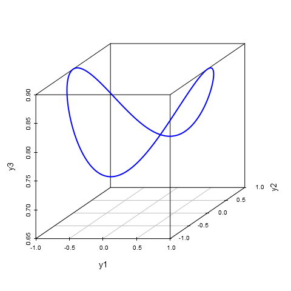

**RabinovichFabrikant**:

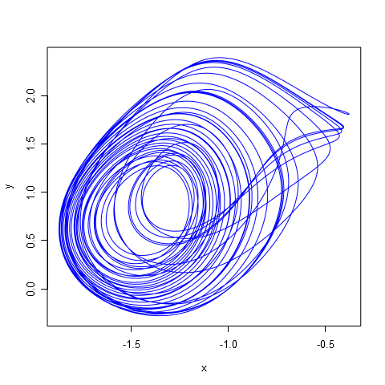

**GeneNetworkModels/Dro-ASC-2Cells**:

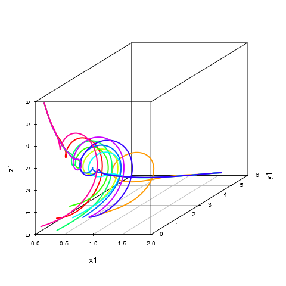

**GeneNetworkModels/Dro-ASC-6d**:

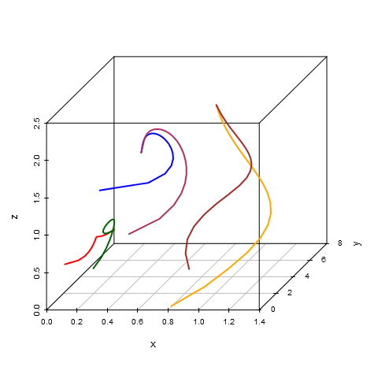

**SprottChaoticFlow A**:

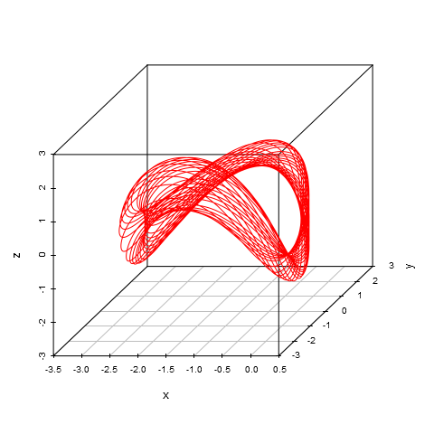

**SprottChaoticFlow B**:

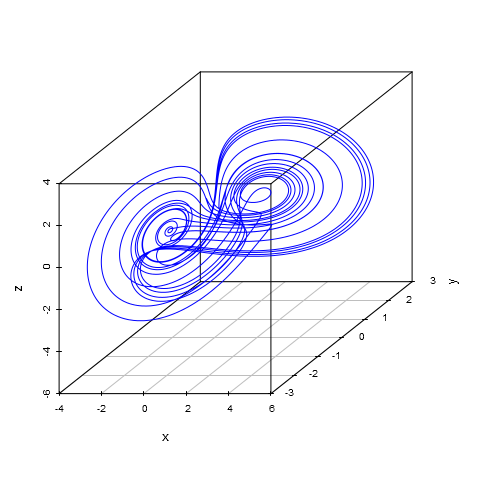

**SprottChaoticFlow C**:

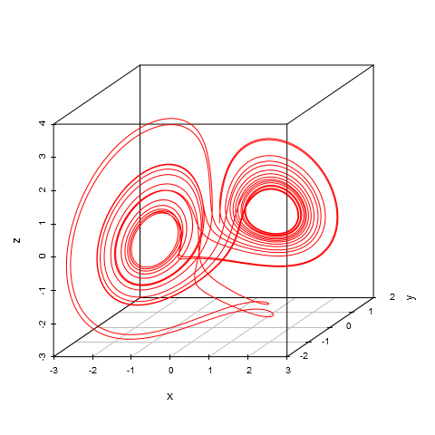

**SprottChaoticFlow D**:

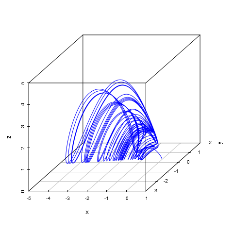

**SprottChaoticFlow E**:

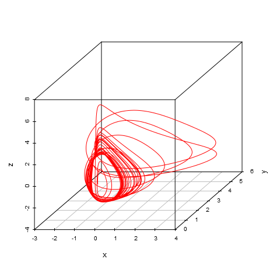

**SprottChaoticFlow F**:

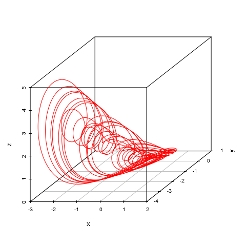

**SprottChaoticFlow G**:

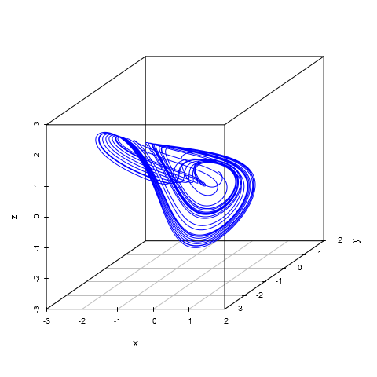

**SprottChaoticFlow H**:

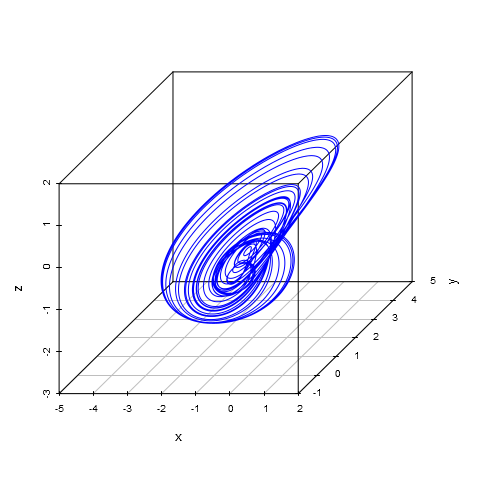

**SprottChaoticFlow I**:

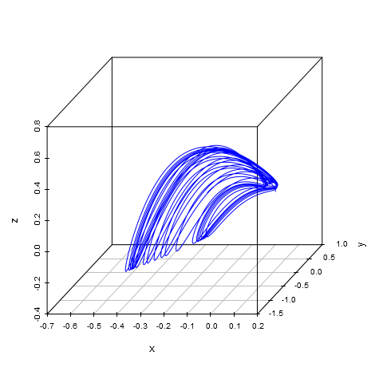

**SprottChaoticFlow J**:

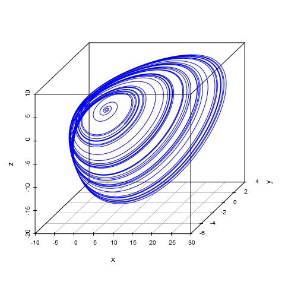

**SprottChaoticFlow K**:

**SprottChaoticFlow L**:

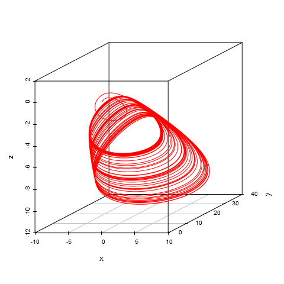

**SprottChaoticFlow M**:

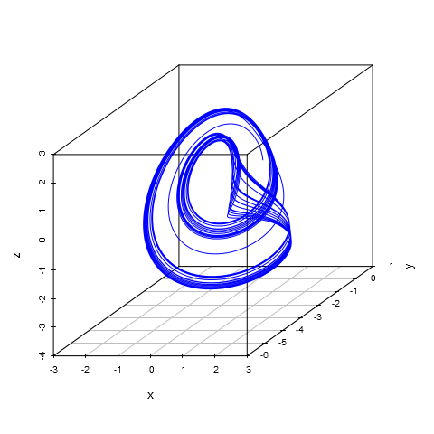

**SprottChaoticFlow N**:

**SprottChaoticFlow O**:

**SprottChaoticFlow P**:

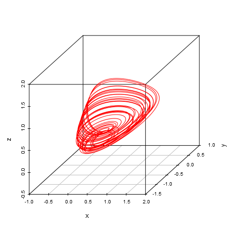

**SprottChaoticFlow Q**:

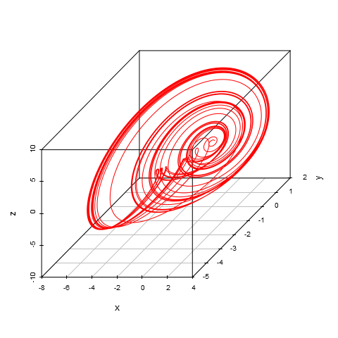

**SprottChaoticFlow R**:

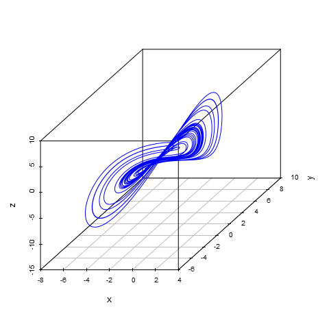

**SprottChaoticFlow S**:

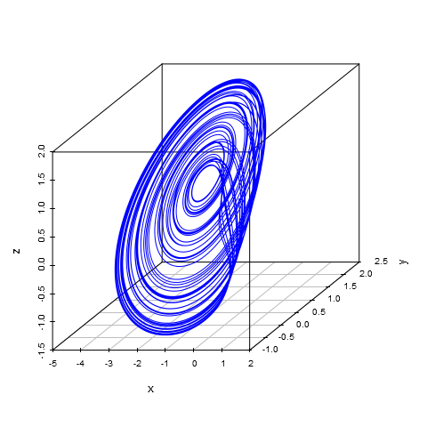