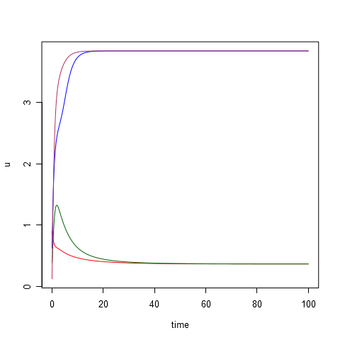
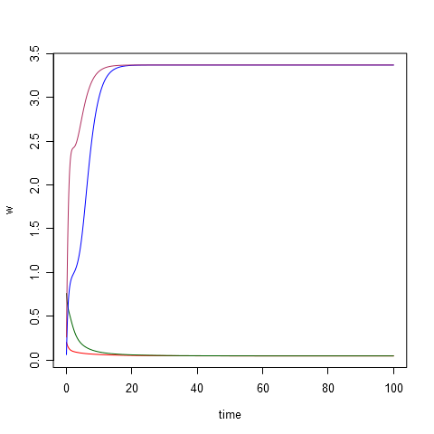
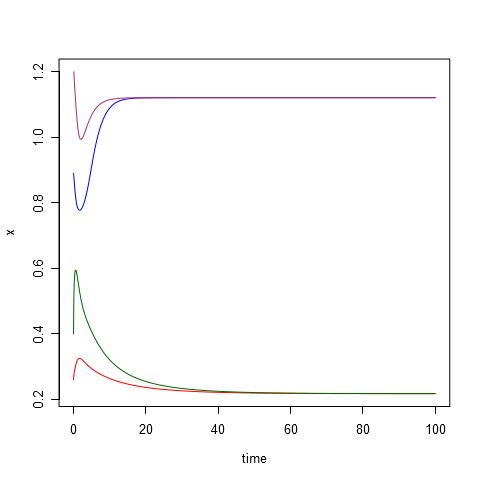
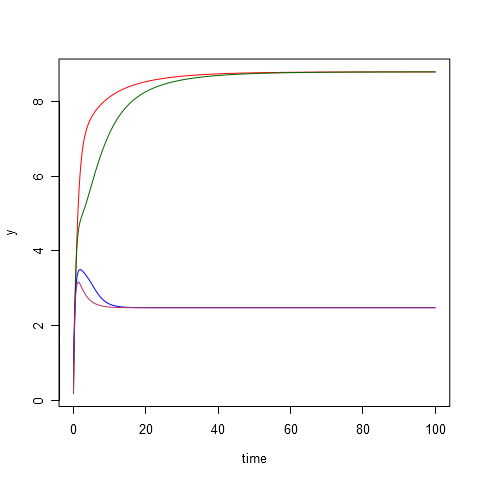
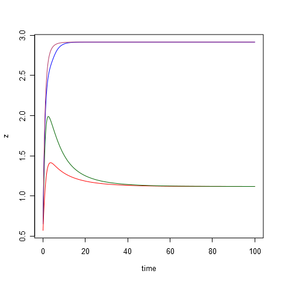
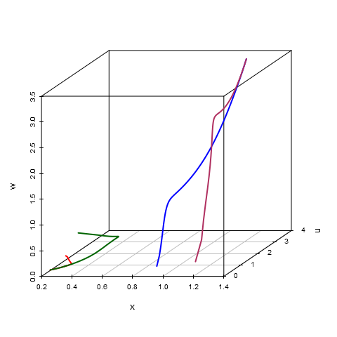
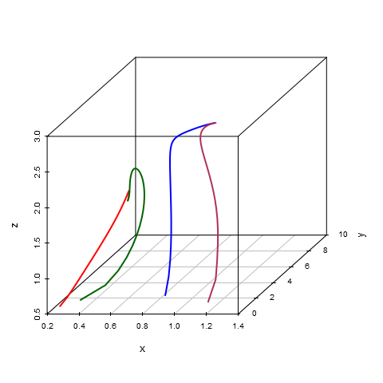

# Parameters #
	d1 = 16.0
	d3 = 18.0
	d5 = 20.0
	A3 =  0.5
	A4 =  1.0
	A5 =  1.5
	B3 =  3.0
	B4 =  4.2
	B5 =  5.0
	k3 =  3.0
	k4 =  3.5
	k5 =  4.0
	C  = 12.0
	D  =  1.5
	E  =  4.0
	G  =  3.0
	U  =  0.0
	gamma = 4

# Initial data #
|id  |     x|     y|     z|     u|     w|
|:---|-----:|-----:|-----:|-----:|-----:|
|t1  |  0.26|  0.37|  0.57|  0.90|  0.20|
|t2  |  0.40|  0.17|  0.68|  0.38|  0.76|
|t3  |  0.89|  0.94|  0.66|  0.62|  0.06|
|t4  |  1.20|  0.21|  0.65|  0.12|  0.26|

# Equilibrium points #
|id  |          x|         y|         z|          u|          w|
|:---|----------:|---------:|---------:|----------:|----------:|
|s1  |  0.2175206|  8.804052|  1.117745|  0.3630088|  0.0452959|
|s2  |  0.7216559|  3.528332|  2.554893|  2.4010401|  0.7920778|
|s3  |  1.1210686|  2.476250|  2.915808|  3.8460383|  3.3700866|

# Modeling results #
**composition.png**:

**plot-time-u.png**:

**plot-time-w.png**:

**plot-time-x.png**:

**plot-time-y.png**:

**plot-time-z.png**:

**plot-x-u-w.png**:

**plot-x-y-z.png**:

