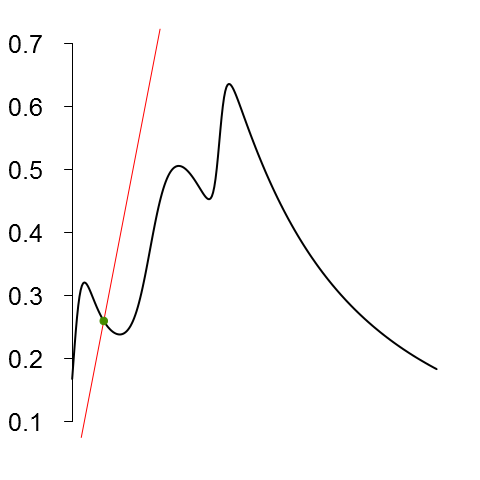
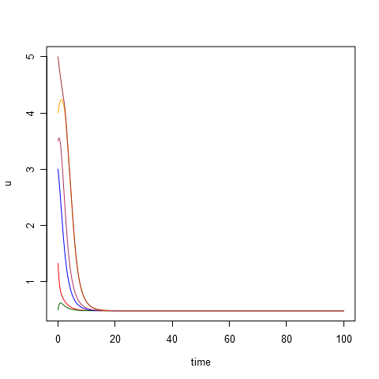
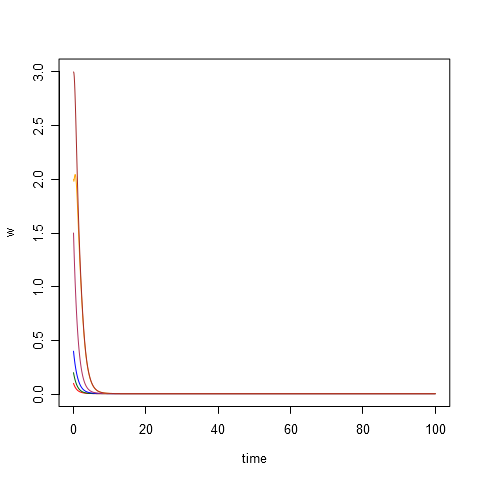
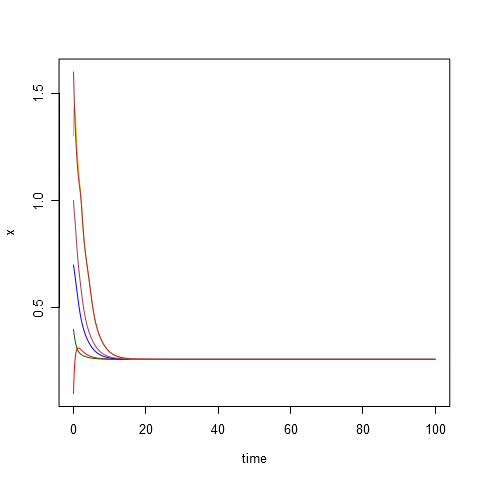
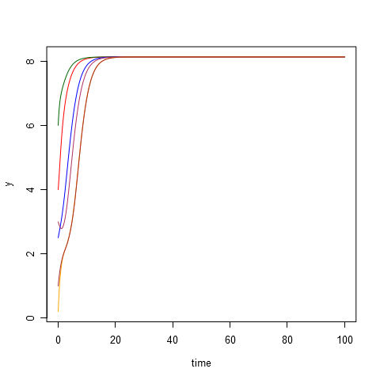
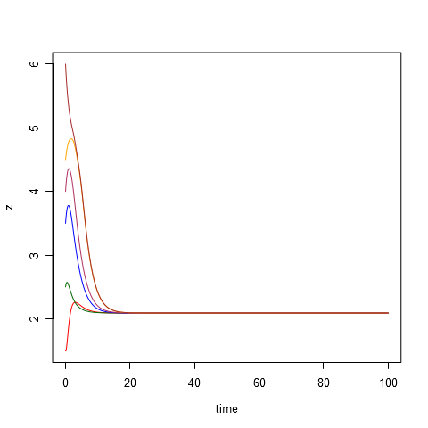
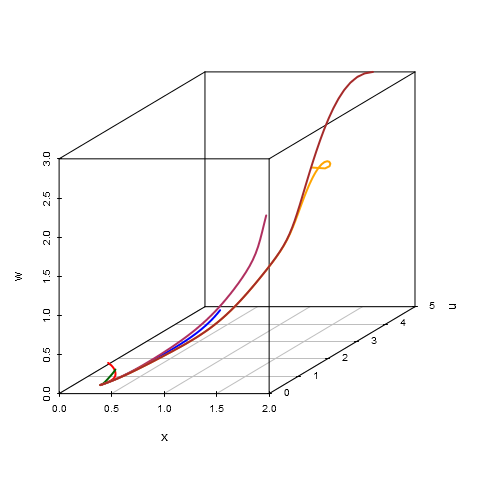
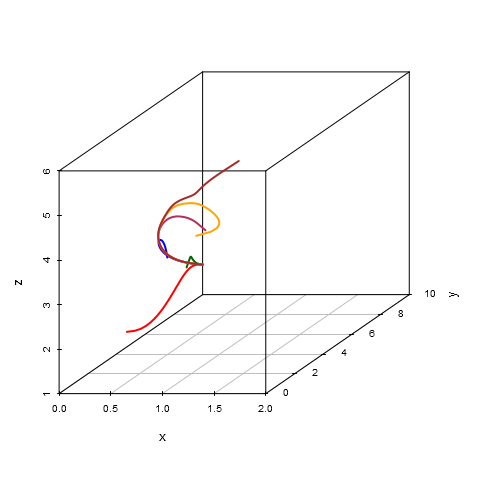

# Parameters #
	d1 = 25.0
	d3 = 17.0
	d5 = 30.0
	A3 =  0.5
	A4 =  1.0
	A5 =  2.1
	B3 =  5.0
	B4 =  4.5
	B5 =  4.0
	k3 =  3.0
	k4 =  3.5
	k5 =  4.0
	C  = 12.0
	D  =  1.5
	E  =  4.0
	G  =  3.0
	U  =  1.0 
	gamma = 8

# Initial data #
|id  |    x|    y|    z|     u|    w|
|:---|----:|----:|----:|-----:|----:|
|t1  |  0.1|  4.0|  1.5|  1.32|  0.1|
|t2  |  0.4|  6.0|  2.5|  0.49|  0.2|
|t3  |  0.7|  2.5|  3.5|  3.00|  0.4|
|t4  |  1.0|  3.0|  4.0|  3.50|  1.5|
|t5  |  1.3|  0.2|  4.5|  4.00|  2.0|
|t6  |  1.6|  1.0|  6.0|  5.00|  3.0|

# Equilibrium points #
|x          |         y|         z|          u|          w|
|:----------|---------:|---------:|----------:|----------:|
|0.2599627  |  8.131445|  2.090999|  0.4757524|  0.0042749|

# Modeling results #
**composition.png**:

**plot-time-u.png**:

**plot-time-w.png**:

**plot-time-x.png**:

**plot-time-y.png**:

**plot-time-z.png**:

**plot-x-u-w.png**:

**plot-x-y-z.png**:

