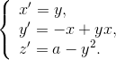

# Description #
Nosé‐Hoover oscillator

# Mathematical model #

# References #
- Nosé, S. Constant temperatur molecular dynamics methods. Progress of theoretical Physics Supplement 103 (1991)1-46.
- Hoover, G. Remark on “Some simple chatoic flows. Physical Review E 51 (1995)759-760.