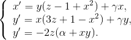

# Description #
The Rabinovich–Fabrikant equations are a set of three coupled ordinary differential equations exhibiting chaotic behavior for certain values of the parameters. They are named after Mikhail Rabinovich and Anatoly Fabrikant, who described them in 1979.

# Mathematical model #

# References #
- Rabinovich, Mikhail I.; Fabrikant, A. L. (1979). "Stochastic Self-Modulation of Waves in Nonequilibrium Media". Sov. Phys. JETP 50: 311–317.