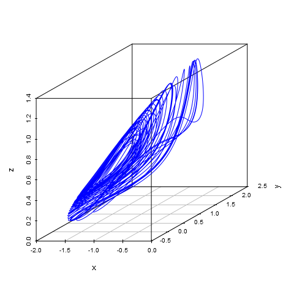
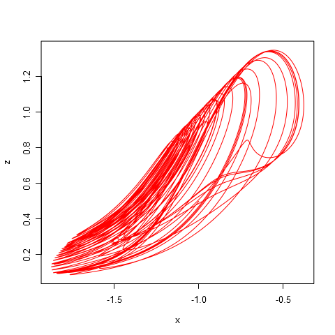
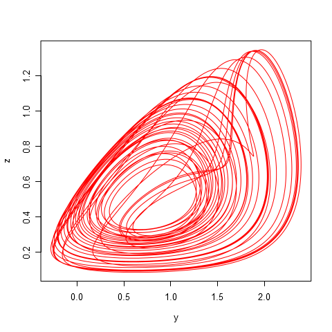

# Parameters #
	alpha = 1.1
	gamma = 0.87

# Initial data #
|x   |  y|    z|
|:---|--:|----:|
|-1  |  0|  0.5|

# Modeling results #
**plot-x-y-z.png**:

**plot-x-y.png**:

**plot-x-z.png**:

**plot-y-z.png**:

