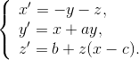

# Description #
The Rössler attractor is the attractor for the Rössler system, a system of three non-linear ordinary differential equations originally studied by Otto Rössler. These differential equations define a continuous-time dynamical system that exhibits chaotic dynamics associated with the fractal properties of the attractor.

# Mathematical model #

# References #
- Rössler, O. E. (1976), "An Equation for Continuous Chaos", Physics Letters 57A (5): 397–398.
- Rössler, O. E. (1979), "An Equation for Hyperchaos", Physics Letters 71A (2,3): 155–157.