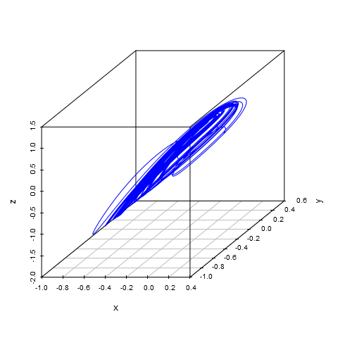

# Parameters #
	kx.y  =  1
	ky.x  =  1
	ky.z  = -1
	kz.x  =  1
	kz.xz =  1
	kz.y  =  2.7

# Initial data #
|x    |    y|    z|
|:----|----:|----:|
|0.1  |  0.1|  0.1|

# Modeling results #
**plot-x-y-z.png**:

