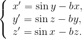

# Description #
Labyrinth chaos system by Rene Thomas.

# Mathematical model #

# References #
- Thomas, R. Deterministic chaos seen in terms of feedback circuits: analysis, synthesis, “labyrint chaos”. Journal of Bifurcation and Chaos 9 (1999)1889-1905
- [J. C. Sprott and K. E. Chlouverakis, International Journal of Bifurcation and Chaos 17, 2097-2108 (2007)](http://sprott.physics.wisc.edu/pubs/paper302.htm)